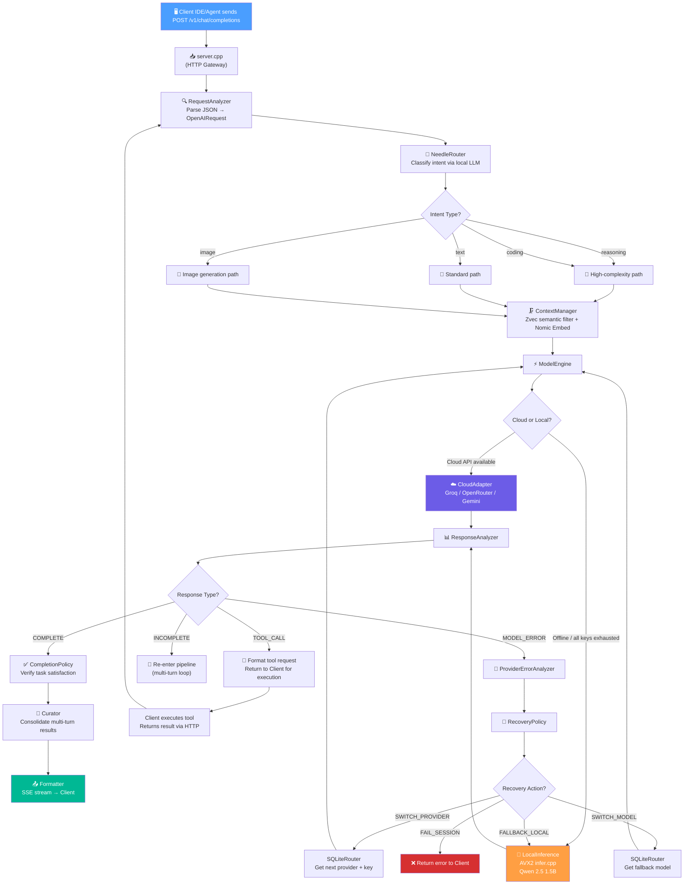
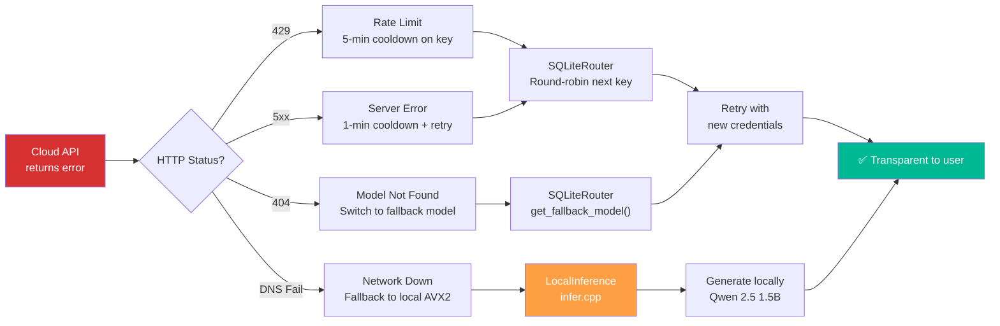
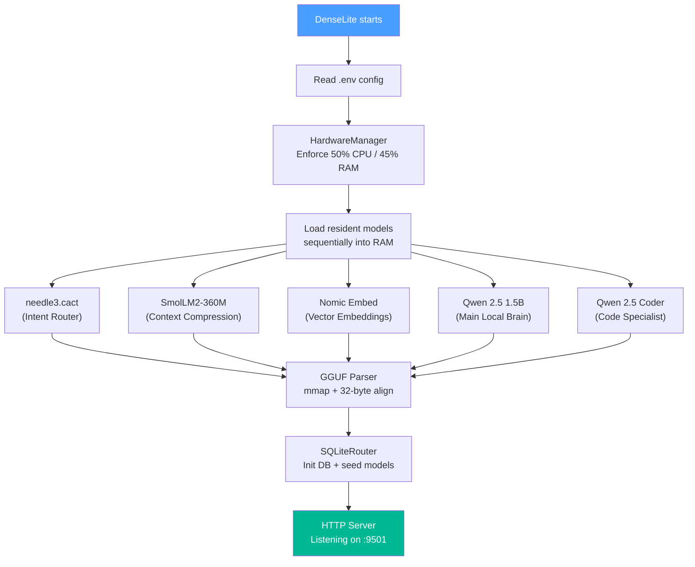

# DenseLite


**DenseLite** is a hyper-optimized, C++ based multi-model orchestration gateway designed to dynamically load, route, and execute large language models, vector embeddings, speech recognition, and image generation locally. It acts as an incredibly fast, edge-optimized "local brain".

> **DenseLite controls intelligence. The Client (IDE/Agent) controls execution.**
> **DenseLite may reason about tools, but DenseLite never executes tools.**

DenseLite operates as a pure **Agentic Inference Engine**. It does not execute bash commands, it does not read the filesystem, and it does not manage workspace permissions. The Client (e.g., Zed, VSCode, Antigravity, or custom scripts) acts as the external harness that manages the environment, tools, and execution. DenseLite acts as the brain that directs the client on what to do.

With V3.0, DenseLite has evolved from a smart proxy into an embedded RAG-powered, self-healing local intelligence core.

---

## Features

- **Dynamic Hot-Loading**: Models are swapped in and out of RAM on-demand to protect hardware limits.
- **Architecture Agnostic GGUF Parsing**: Capable of dynamically detecting and parsing `.context_length`, `.block_count`, and other metadata for *any* standard GGUF architecture out-of-the-box (Qwen, Llama, Nomic, Mistral, etc.).
- **Multi-Modal Support**: Integrated pipelines for text (Qwen / SmolLM), speech-to-text (Whisper), image generation (Stable Diffusion 1.5), and vector embeddings (Nomic).
- **Semantic Intent Routing**: Employs a specialized "Needle 3" router to intelligently classify intent and route requests using structured JSON assessments.
- **Deterministic Self-Healing**: Provider error recovery uses SQLite-backed model/key lookups — never LLM-based guessing.
- **Embedded Vector Search**: Alibaba Zvec provides sub-millisecond semantic retrieval over conversation history.
- **Custom AVX2 Inference Engine**: A 100% hand-rolled Transformer engine (`infer.cpp`) with raw Intel intrinsics for Q8_0 dequantization, RoPE, and SwiGLU.
- **Hardware Enforced**: Built-in strict hardware limit enforcement (50% CPU, 45% RAM) to prevent OOM on edge hardware.
- **No Path Hardcoding**: Auto-resolves execution environments dynamically.

---

## How It Works

When a Client IDE or Agent sends a request to DenseLite, it flows through a deterministic pipeline of specialized C++ modules. Each module has a single responsibility and a clean interface boundary.

### Request Lifecycle



### Error Recovery & Self-Healing Flow



### Model Loading at Boot



---

## Quick Start


### 1. Setup Environment

Clone the repository and copy the example environment file:
```bash
git clone https://github.com/ahtesham-clcbws/DenseLite.git
cd DenseLite
cp env.example .env
```

### 2. Download Models

All required models must be placed inside a `models/` directory at the root of the project.
You can find the direct HuggingFace download links for each supported model inside the `env.example` file. 

To download them manually, you can use `wget` or `curl`. For example:
```bash
mkdir -p models/needle3
# Example: Downloading a GGUF model
wget https://huggingface.co/Qwen/Qwen2.5-1.5B-Instruct-GGUF/resolve/main/qwen2.5-1.5b-instruct-q8_0.gguf -O models/Qwen2.5-1.5B-Instruct-Q8_0.gguf
```
Ensure the filenames perfectly match the paths defined in your `.env` configuration (e.g. `MODEL_LOCAL_QWEN_PATH=models/Qwen2.5-1.5B-Instruct-Q8_0.gguf`).

### 3. Build from Source

DenseLite uses CMake and heavily depends on AVX2/FMA optimizations for its internal inference engine and Zvec vector database.

```bash
mkdir build
cd build
cmake -DCMAKE_POLICY_VERSION_MINIMUM=3.5 ..
make -j4 DenseLite
```

### 4. Run the Gateway

Execute the compiled binary from the `build` directory:
```bash
./DenseLite
```
The API server will spin up on `http://localhost:9501`.

### 5. How to Use DenseLite (API)

DenseLite exposes a standard OpenAI-compatible HTTP REST API. Once running, you can connect any agent, IDE, or script to `http://localhost:9501/v1` as the base URL.

Here is a standard cURL example to interact with the engine:
```bash
curl http://localhost:9501/v1/chat/completions \
  -H "Content-Type: application/json" \
  -d '{
    "model": "auto",
    "messages": [
      {"role": "system", "content": "You are a helpful assistant."},
      {"role": "user", "content": "Write a python script to reverse a string."}
    ],
    "stream": true
  }'
```
DenseLite will intercept this, use `NeedleRouter` to classify the intent as `coding`, search history via `Zvec` if needed, select the best model (Cloud API or Local fallback), and stream the Server-Sent Events (SSE) back to the caller.

### 6. Run E2E Tests

```bash
./test_e2e.sh
```

---

## Architecture

### The Execution Lifecycle & `InferenceSession`

DenseLite orchestrates complex workflows through an explicit state machine inside `InferenceSession`. Because DenseLite pauses and resumes when Zed executes a tool, the session maintains state across HTTP boundaries.

```cpp
enum class SessionStatus {
    CREATED,
    ANALYZING,
    ROUTING,
    INFERRING,
    WAITING_FOR_TOOL,
    PROCESSING_TOOL_RESULT,
    CONTINUING,
    COMPLETED,
    FAILED,
    CANCELLED
};

struct InferenceSession {
    std::string session_id;
    std::string request_id;
    SessionStatus status;
    TaskType task_type;
    uint32_t iteration;
    uint32_t max_iterations;
    std::string selected_model;
    bool waiting_for_tool;
    bool streaming;
};
```

### The V3.0 Transformation

- **Stripped `server.cpp`:** Removed monolithic logic from the HTTP server, relegating it to a pure routing gateway.
- **Added Semantic Routing:** Replaced keyword-based string matching with `NeedleRouter` (Needle 3), using structured JSON assessments for true intent understanding.
- **Implemented Deterministic Provider-State Healing:** Built `ProviderErrorAnalyzer` and `SQLiteRouter` logic to intercept errors. Rather than letting an LLM guess replacements, it hits provider `/v1/models` endpoints to deterministically map available fallback infrastructure.
- **Embedded Alibaba Zvec:** Pulled the production-grade `alibaba/zvec` vector database directly into the C++ tree to enable true local semantic memory slicing for context.
- **Abstracted `ModelEngine` & Added `Curator`:** Extracted inference into a dedicated engine and added a Curator layer to consolidate multi-turn results before serializing.
- **Revealed the Custom AVX2 Engine:** Committed to the custom, hand-rolled C++ Transformer engine (`infer.cpp`) capable of running Qwen 2.5 natively.

### What We Have Now

A single, ultra-lightweight C++ binary (`DenseLite`) with zero external runtime dependencies. It manages the entire state machine of an `InferenceSession`, slices context infinitely via `Zvec`, falls back to its internal `AVX2` engine when offline, and flawlessly orchestrates the Zed IDE.

---

### Technology Choices

#### Why Alibaba Zvec instead of SQLite for Context

Zvec acts as the **semantic retrieval index**. Context is composed of three conceptual layers:
1. **ContextStore:** Stores conversation chunks and metadata.
2. **EmbeddingEngine:** (Nomic Embed) converts chunks to high-dimensional floats.
3. **VectorIndex:** (**Zvec**) performs HNSW/DiskANN distance calculations.

Unlike SQLite's exact string matching (`LIKE '%code%'`), Zvec understands semantic meaning, allowing DenseLite to find the most relevant context across a 10,000-message conversation in sub-milliseconds.

#### Why SQLite for State Management

SQLite is perfectly designed for ACID-compliant, deterministic, tabular data. We use it strictly in `sqlite_router.cpp` for the `denselite_state.db`. It manages API Keys, Provider URLs, Model Names, and Cooldown Timestamps.

#### Why NOT MNN, llama.cpp, or Ollama

| Alternative | Why Not |
|---|---|
| **Ollama** | Requires a heavy background daemon and Docker-like abstractions |
| **llama.cpp** | Pulls in massive unused hardware backends (Vulkan, CUDA, Metal, ROCm) causing binary bloat |
| **MNN** | Designed for generic deep learning on edge devices, carrying bloat for convolutions and vision |
| **DenseLite** | A **100% custom-built AVX2 Transformer engine** with raw intrinsics for Q8_0 dequantization, RoPE, and SwiGLU — the fastest, smallest possible binary tailored to Qwen 2.5 |

---

### Core Modules & File Structure

```text
DenseLite/
├── CMakeLists.txt              # Master build script.
├── .env                        # Runtime configuration containing API keys and paths (NOT committed).
├── env.example                 # Environment template with HuggingFace model download links.
│
├── src/                        # The Intelligent Core
│   ├── server.cpp              # The Gateway: Thin HTTP listener that receives standard OpenAI JSON payloads.
│   ├── DenseLiteEngine.*       # The Orchestrator: Owns the InferenceSession and manages the state machine across tool calls.
│   ├── RequestAnalyzer.*       # The Payload Parser: Safely parses inbound JSON into an internal OpenAIMessage structure.
│   ├── NeedleRouter.*          # The Semantic Brain: Small intent classification LLM that tags requests (e.g., coding, text, reasoning).
│   ├── sqlite_router.*         # The Deterministic Registry: SQLite state machine for tracking keys, cooldowns, and provider limits.
│   ├── ProviderErrorAnalyzer.* # The Error Interceptor: Traps 400/404/429 HTTP errors and decides if recovery is possible.
│   ├── RecoveryPolicy.*        # The Recovery Decider: Defines the retry strategy (Switch Key vs Switch Provider vs Fallback Local).
│   ├── ContextManager.*        # The Memory Slicer: Interfaces with Zvec and Nomic Embed to semantically filter massive conversation histories.
│   ├── ModelEngine.*           # The Inference Abstraction: The interface boundary between hitting a Cloud API or the Local CPU.
│   ├── ResponseAnalyzer.*      # The Output Classifier: Inspects outputs to detect if it's a TOOL_CALL, COMPLETE, or ERROR.
│   ├── CompletionPolicy.*      # The Completion Verifier: Ensures the task intent was actually satisfied before returning.
│   ├── Curator.*               # The Consolidator: Merges multi-turn tool interactions into a single cohesive response stream.
│   ├── Formatter.*             # The Protocol Serializer: Packages the internal state back into standard OpenAI JSON/SSE formats.
│   ├── ProviderSync.*          # The Model Syncer: Background job to fetch real-time `/v1/models` availability from providers.
│   ├── HardwareManager.hpp     # The Resource Governor: Enforces dynamic CPU and RAM budgets to prevent out-of-memory errors.
│   │
│   ├── infer.cpp / .hpp        # The Transformer Core: A pure, hand-rolled AVX2 inference engine for GQA, RoPE, and SwiGLU.
│   ├── avx2_math.hpp           # The Math Kernels: Raw Intel AVX2/FMA intrinsics for extremely fast vector matrix multiplication.
│   ├── gguf_parser.cpp / .hpp  # The Weight Loader: Memory-maps (mmap) and 32-byte aligns tensor weights from standard GGUF files.
│   ├── model.hpp               # The Data Structures: Internal structs for Tensors, Layers, and the DenseModel.
│   └── httplib.h               # The Network Layer: A single-header HTTP client/server library.
│
├── dependencies/
│   ├── json.hpp                # nlohmann/json (vendored).
│   └── zvec/                   # Alibaba Zvec vector database (git submodule).
│
└── models/                     # Local model weights (not committed).
```

### Dependencies & Third-Party Libraries

DenseLite is designed with zero runtime dependencies. However, it leverages a few specialized build-time libraries to ensure high performance:

1. **Alibaba Zvec** (`dependencies/zvec/`):
   - **What it is:** A production-grade C++ vector search engine using HNSW and DiskANN.
   - **Why we use it:** Instead of pushing a 50,000-token conversation history to an LLM, DenseLite embeds user queries and uses Zvec to instantly search past context for only the most semantically relevant chunks. This saves massive token costs and processing time.
2. **nlohmann/json** (`dependencies/json.hpp`):
   - **What it is:** The premier C++ JSON library.
   - **Why we use it:** Robust, crash-proof parsing of inbound HTTP request payloads and outbound SSE streams. String-manipulation logic for JSON is inherently unsafe and brittle; `nlohmann/json` ensures integrity.
3. **cpp-httplib** (`src/httplib.h`):
   - **What it is:** A minimal, single-header C++ HTTP/HTTPS library.
   - **Why we use it:** It enables DenseLite to spin up an ultra-light REST API (like `server.cpp`) and make outbound HTTP requests to Cloud LLMs without pulling in massive dependencies like Boost.Asio or libcurl.
4. **OpenMP** (Standard Compiler Flag):
   - **What it is:** API for multi-platform shared-memory parallel programming.
   - **Why we use it:** To strictly enforce thread-budgets on CPU hardware during local tensor math (`avx2_math.hpp`), allowing parallel matrix dot-products without consuming the entire OS scheduler.

---

### Conceptual Architecture

```mermaid
graph TD
    %% CLIENT LAYER
    subgraph Client[Client IDE / Agent]
        Z1[Workspace]
        Z2[Files]
        Z3[Terminal]
        Z4[MCP / Skills]
        Z5[Tool Execution]
    end

    Client -- "OpenAI-compatible API" --> Engine

    %% DENSELITE LAYER
    subgraph DenseLite
        Engine[DenseLiteEngine]
        Session[InferenceSession]

        Engine --> Session

        Session --> Req[RequestAnalyzer]
        Req --> Needle[Needle 3 Router]
        Needle --> Context[ContextManager]
        Context --> ModEng[ModelEngine]

        ModEng --> Cloud[Cloud API]
        ModEng --> Local[Local AVX2 infer.cpp]

        Cloud --> RespAnalyze[ResponseAnalyzer]
        Local --> RespAnalyze

        RespAnalyze -->|TOOL_CALL| Client
        RespAnalyze -->|INCOMPLETE| Session
        RespAnalyze -->|MODEL_ERROR| Recovery[ProviderErrorAnalyzer]
        Recovery --> RecPolicy[RecoveryPolicy]
        RecPolicy --> SqlRouter[SQLiteRouter]
        SqlRouter --> ModEng

        RespAnalyze -->|COMPLETE| CompPolicy[CompletionPolicy]
        CompPolicy -->|Not Acceptable| Session
        CompPolicy -->|Acceptable| Curate[Curator]

        Curate --> Format[Formatter]
        Format --> Client
    end
```



---

### Dynamic Resource Budgets

DenseLite is designed to be an ultra-lightweight citizen on any operating system, treating hardware limits as strict budgets.

| Resource | Budget | Enforcement |
|---|---|---|
| **CPU** | 50% of total capacity | On a 2-core/4-thread machine → 2 threads max |
| **RAM** | 45% of total capacity | On 32GB → 14.4GB ceiling |

**Deterministic Memory Eviction Order** (when RAM budget is breached):

1. Evict temporary inference buffers
2. Evict old context cache
3. Reduce Zvec retrieval cache
4. Unload inactive local model
5. Refuse new local inference

DenseLite auto-detects `std::thread::hardware_concurrency()` and physical memory at boot to calculate these budgets.

---

### Execution Scenarios

#### Scenario 1: The Infinite Context Request
> **User:** "Review all the changes we made to the networking stack yesterday and suggest improvements."
> **Problem:** The conversation history is 50,000 tokens long.
> **Resolution:** `ContextManager` uses **Zvec** to extract only the 1,500 most semantically relevant tokens discussing "networking" and "changes", saving API cost and token limits.

#### Scenario 2: The Deterministic Cooldown Healing
> **User:** Hits "Generate Script" in the Client.
> **Problem:** The primary Groq API key hits a rate limit (HTTP 429).
> **Resolution:** `ProviderErrorAnalyzer` catches the 429, logs a 60-second cooldown in `sqlite_router`, and instantly maps to the next best available model (e.g., OpenRouter Llama-3). The user experiences a sub-second delay.

#### Scenario 3: The Tool Continuation Loop
> **User:** "Find all TODO comments and fix them."
> **Resolution:** DenseLite's `ResponseAnalyzer` identifies a `TOOL_CALL` request → formats JSON → passes to the Client → Client executes `grep` and edits → returns "Success" via HTTP POST → DenseLite resumes the `InferenceSession` → loops until `COMPLETE`.

#### Scenario 4: The Offline Fallback (Airplane Mode)
> **User:** Asks for a regex pattern while on a plane with no Wi-Fi.
> **Resolution:** `sqlite_router` detects network failure. `ModelEngine` seamlessly routes to `LocalInference` (`infer.cpp`). The local Qwen 2.5 1.5B model spins up natively on CPU cores.

---

## Extending DenseLite

DenseLite is built to be easily extended! The `server.cpp` initialization dynamically loads models based on your `.env` configuration. You can easily plug new models in, or extend the `DenseLiteEngine` class to handle new routing logic for specialized use cases.

See [CONTRIBUTING.md](CONTRIBUTING.md) for development guidelines, code standards, and the PR process.

---

## Community

- [Code of Conduct](CODE_OF_CONDUCT.md)
- [Contributing Guidelines](CONTRIBUTING.md)
- [Security Policy](SECURITY.md)

## License

MIT License. **Anyone can use this in commercial or personal projects.**
*Condition:* My name (Ahtesham) and this GitHub repository link must be mentioned/attributed in your project or codebase. See [LICENSE](LICENSE) for details.
