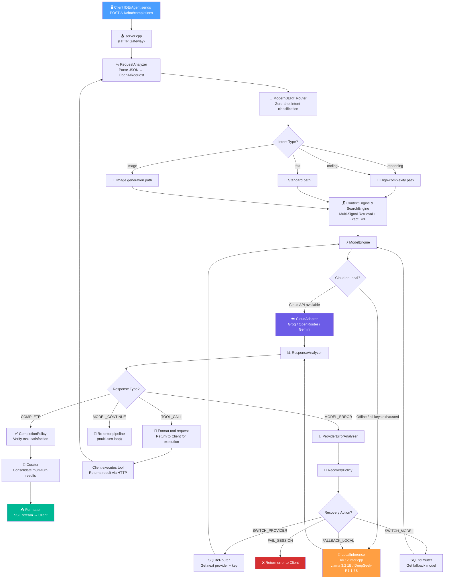
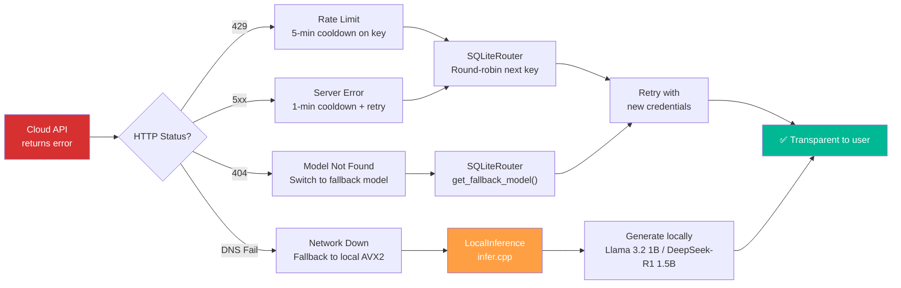
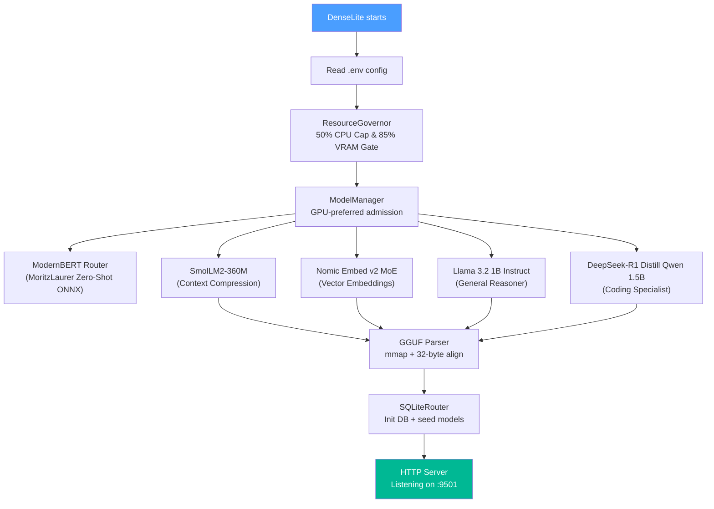

# DenseLite


**DenseLite** is a hyper-optimized, C++ based multi-model orchestration gateway designed to dynamically load, route, and execute large language models, vector embeddings, speech recognition, and image generation locally. It provides Vulkan 1.3 GPU resource management and admission gating paired with a high-performance AVX2+FMA SIMD transformer forward pass, acting as an edge-optimized "local brain".

> **DenseLite controls intelligence. The Client (IDE/Agent) controls execution.**  
> **DenseLite may reason about tools, but DenseLite never executes tools.**

DenseLite operates as a pure **Agentic Inference Engine**. It does not execute bash commands, it does not read the filesystem, and it does not manage workspace permissions. The Client (e.g., Zed, VSCode, Antigravity, OpenCode, or custom scripts) acts as the external harness that manages the environment, tools, and execution. DenseLite acts as the brain that directs the client on what to do.

With v4.0.0, DenseLite introduces **Native C++ Tray Supervisor & WebUI Dashboard (`DenseLiteTray`)**, **ModernBERT Zero-Shot Intent Routing**, **Session Tool Registry** (eliminating 600 KB MCP payload bloat and client timeouts), **Dynamic RAM-Aware Context Sizing** (scaling from 16K up to 64K tokens safely), **Persistent Session KV Cache Prefix Caching** (instant multi-turn response without re-evaluating history), and **High-Speed Disk-Backed KV Serialization** (2.24 GB/s binary format).

> [!NOTE]
> **Test Suite Verification:** All 17 automated CTest test suites pass cleanly with 100% deterministic success (~24.7s), verified against real GGUF weights and hardware SIMD kernels.

---

## Features
 
- **Native C++ System Tray Supervisor (`DenseLiteTray`)**: Zero-Python native C++20 tray daemon utilizing `libayatana-appindicator3` and `gtk+-3.0` (~6 MB RAM, 0% CPU idle). Hard-coupled supervisor process management guarantees engine termination on tray exit.
- **Glassmorphic Settings & Telemetry Dashboard (`web/`)**: Native ES module web dashboard for real-time CPU/RAM/VRAM gauges, inference parameter tuning, dynamic model-role mapping, and live streaming console logs.
- **ModernBERT Zero-Shot Intent Router**: Embedded ONNX Runtime C++ zero-shot classifier routing queries sub-10ms across coding, reasoning, audio, image, and compressor model domains.
- **Session Tool Registry**: Caches MCP tool definitions per session; deduplicates repeated schemas and eliminates 600 KB payload bloat. Prunes schemas to 0 for general chat or selectively injects relevant tools (434K handshakes/sec, 0.45 us retrieval).
- **Persistent Session KV Cache**: Maintains per-session KV state across turns. Employs prefix delta matching ($0 \to L$ skipped, delta prefill strictly $L \to N$ at 1.67M matches/sec) for instantaneous multi-turn generation.
- **High-Speed Disk-Backed KV Persistence**: High-speed binary serialization (`DLKV` magic header) saving active tokens to disk at 2,243 MB/s, validating multi-model architectures upon restoration to prevent cross-model memory corruption.
- **Dynamic RAM-Aware Context Sizing**: Automatically checks balance RAM headroom after baseline allocation; unlocks 32K or 64K tokens (65,536 tokens on 32GB RAM systems) with zero OOM risk.
- **GPU-Preferred Unified Placement**: Workloads attempt Vulkan GPU compute allocation first, with automatic, deterministic fallback to Host CPU/RAM.
- **85% VRAM Safety Ceiling**: Strict safety gate ($2048\text{ MiB} \times 0.85 = 1740\text{ MiB}$) reserving 15% (~308 MiB) for host display servers (X11/Wayland) and desktop compositors. DL should never use the GPU above a maximum of 85%.
- **Strict Inference Binding**: If a model is assigned to the GPU (Free VRAM ≥ Model + Overhead), its memory is allocated in Vulkan. If VRAM is insufficient, the model silently falls back to System RAM. Transformer inference always runs strictly on CPU via AVX2. No hybrid layer splitting is allowed.
- **Host-Bound KV Cache via RAM Mapping**: The KV Cache MUST always reside in System RAM to prevent OOM errors at large context windows, regardless of execution context. When inferring, DL computes attention directly in Host RAM.
- **RAII ModelLease & Eviction Guards**: Reference-counted model leases (`active_users`) prevent unmapping or memory eviction during active inference (5.39M ops/sec).
- **Native C++ Runtime**: Native CPU transformer forward pass (statically linked, no Python/Node) (`infer.cpp`) with AVX2 + FMA intrinsics, Q4_0 / Q8_0 dequantization, dynamic RoPE (`RopeConfig`), RMSNorm, and SwiGLU. (C/C++ static dependencies only).
- **Hardened Hardware Governance**: DenseLite strictly manages resource allocation via `ResourceGovernor`.
  - **GPU Safety Ceiling**: GPU VRAM admission is enforced strictly, though active LLM inference currently runs via CPU AVX2. DenseLite will **never** use the GPU above a strict **85% VRAM ceiling**.
  - **CPU Core Constraint**: Enforces a strict 50% CPU thread cap (e.g., maximum 2 threads on a 4-thread device).
  - **RAM Safety Ceiling**: Strict memory allocation boundaries (50% max host RAM, typically ~16 GB). KV cache is always stored exclusively in host RAM.
- **Native Trie BPE Tokenizer & Context Engine**: Trie-based tokenization (1.42M tok/s), zero-alloc fast counting (1.52M tok/s), strict $\ge 25\%$ generation reserve invariant, and ChatML context compilation.
- **Two-Tier Persistent Memory Store**: Durable SQLite canonical storage + in-RAM tiered cache for sub-millisecond lexical & semantic recall (121K reads/s).
- **Tree-sitter Code Intelligence**: AST syntax-aware code parsing, structural symbol extraction (`FUNCTION`, `CLASS`, `METHOD`), and 64-bit FNV-1a incremental delta change tracking (4.42 GB/s).
- **Unified Multi-Signal Search**: Combined Exact, Lexical BM25, Dense Vector, and Structural Tree-sitter retrieval with deterministic `ResultFusion` scoring (203K fusions/s). *Note: Semantic search uses the 4-bit AVX2 TurboQuant exhaustive SIMD scan (not ANN).*
- **Evidence-Based Autonomous Agent Loop**: 5-state response parsing with stop-reason discrimination, 7-action self-healing fault recovery (13.0M decisions/s), and anti-hallucination completion verification (105.6M evals/s).
- **2-Core Resource Governance**: Dynamic OpenMP thread throttling capped at 50% CPU ($\le 2$ threads) and a 6-stage progressive eviction cascade for low-power edge laptops. (Note: `/proc` hardware governance is explicitly optimized for Linux/WSL2).
- **On-Demand Leased Multimodal Engine**: Offline speech-to-text with Whisper.cpp (29.4K chunks/sec) and Stable Diffusion image generation (0-byte permanent RAM footprint). *Capabilities represent synthetic prototype benchmarks and are not yet optimized for production workloads.*

> [!WARNING]
> **Vulkan Boundary Note:** While Vulkan is used for vector search and RMSNorm acceleration, the core Transformer inference pass currently remains fully CPU AVX2/FMA bound.
> **64K Context Note:** The 64K structural infrastructure is fully tested for memory safety and allocation limits, but real-world 64K-token inference passes remain unbenchmarked for generation quality and perplexity drop-off.

---

## Comprehensive System Benchmarks (🟢 EMPIRICALLY VERIFIED 2026-09-29)

Official hardware-level empirical benchmarks recorded on host Intel Core i7-6500U:
- [00_DENSELITE_MASTER_BENCHMARK_REPORT.md](benchmarks/00_DENSELITE_MASTER_BENCHMARK_REPORT.md): Authoritative system benchmark scorecard, execution summary, and master performance metrics.
- [01_HARDWARE_AND_ENVIRONMENT_AUDIT.md](benchmarks/01_HARDWARE_AND_ENVIRONMENT_AUDIT.md): Low-level hardware platform, SIMD instructions, Vulkan 1.3 GPU limits, and OS environment.
- [02_INFERENCE_AND_RUNTIME_BENCHMARK.md](benchmarks/02_INFERENCE_AND_RUNTIME_BENCHMARK.md): Native AVX2+FMA mathematical correctness, dynamic GGUF parsing, multi-model speed, and TTFT.
- [03_LIFECYCLE_AND_MEMORY_SAFETY.md](benchmarks/03_LIFECYCLE_AND_MEMORY_SAFETY.md): RAII ModelLease throughput (5.39M ops/s), 85% VRAM ceiling, and bounded KV cache memory.
- [04_BPE_TOKENIZER_AND_CONTEXT_BENCHMARK.md](benchmarks/04_BPE_TOKENIZER_AND_CONTEXT_BENCHMARK.md): Trie BPE encoding (1.42M tok/s), zero-allocation token counting, and ChatML context compilation.
- [05_PERSISTENT_MEMORY_AND_AST_CODE_INTEL.md](benchmarks/05_PERSISTENT_MEMORY_AND_AST_CODE_INTEL.md): SQLite canonical storage, TurboQuant SIMD recall, Tree-sitter AST parsing, and 64-bit FNV-1a hash delta tracking (4.42 GB/s).
- [06_HYBRID_SEARCH_AND_AGENTIC_LOOP.md](benchmarks/06_HYBRID_SEARCH_AND_AGENTIC_LOOP.md): 4-channel retrieval ResultFusion, 5-state response parsing, and 7-action self-healing fault recovery.
- [07_RESOURCE_GOVERNANCE_AND_MULTIMODAL.md](benchmarks/07_RESOURCE_GOVERNANCE_AND_MULTIMODAL.md): OpenMP $\le 2$ thread throttling, 6-stage progressive eviction cascade, Whisper STT, and Stable Diffusion.
- [08_FINAL_REALITY_AUDIT_MATRIX.md](benchmarks/08_FINAL_REALITY_AUDIT_MATRIX.md): Comprehensive reality audit matrix verifying 100% completion and resolution of all initial regressions.
- [09_SESSION_KV_AND_TOOL_REGISTRY_BENCHMARK.md](benchmarks/09_SESSION_KV_AND_TOOL_REGISTRY_BENCHMARK.md): Session Tool Registry, Dynamic 64K Context Sizing, and Disk-Backed Persistent Session KV Cache.

---

## Roadmap: DenseLite v4.0 (Target: October 2026)

- **DenseLite v4.0 Native UI & Management Dashboard** — 🚀 **IN DESIGN (Delivering October 2026)**
  Comprehensive visual desktop interface and developer dashboard:
  - **Real-Time Telemetry & Token Streaming:** Live visualization of AVX2 forward pass throughput, TTFT latency, active KV cache expansion, and SSE chunk output.
  - **Memory & AST Visual Explorer:** Interactive inspection of canonical SQLite memory, active working sessions, and Tree-sitter AST syntax symbol trees.
  - **Resource Governance Console:** Visual dials for OpenMP thread allocation, host RAM headroom gauges, and live multi-stage eviction cascade monitors.
  - **Direct Workspace UI:** Integrated chat canvas, multimodal voice input monitor, and local image generation gallery.

---

## How It Works

When a Client IDE or Agent sends a request to DenseLite, it flows through a deterministic pipeline of specialized C++ modules. Each module has a single responsibility and a clean interface boundary.

### Request Lifecycle


```mermaid
flowchart TD
    A["🖥️ Client IDE/Agent sends POST /v1/chat/completions"] --> B["📥 server.cpp<br/>(HTTP Gateway)"]
    B --> C["🔍 RequestAnalyzer<br/>Parse JSON → OpenAIRequest"]
    C --> D["🧠 ModernBERT Router<br/>Zero-shot intent classification"]
    D --> E{"Intent Type?"}

    E -->|"reasoning"| F["📐 High-complexity path"]
    E -->|"coding"| F
    E -->|"text"| G["💬 Standard path"]
    E -->|"image"| H["🎨 Image generation path"]

    F --> I["🗜️ ContextEngine & SearchEngine<br/>Multi-Signal Retrieval + Exact BPE"]
    G --> I
    H --> I

    I --> J["⚡ ModelEngine"]
    J --> K{"Cloud or Local?"}

    K -->|"Cloud API available"| L["☁️ CloudAdapter<br/>Groq / OpenRouter / Gemini"]
    K -->|"Offline / all keys exhausted"| M["🔧 LocalInference<br/>AVX2 infer.cpp<br/>Llama 3.2 1B / DeepSeek-R1 1.5B"]

    L --> N["📊 ResponseAnalyzer"]
    M --> N

    N --> O{"Response Type?"}

    O -->|"COMPLETE"| P["✅ CompletionPolicy<br/>Verify task satisfaction"]
    O -->|"TOOL_CALL"| Q["🔨 Format tool request<br/>Return to Client for execution"]
    O -->|"MODEL_CONTINUE"| R["🔄 Re-enter pipeline<br/>(multi-turn loop)"]
    O -->|"MODEL_ERROR"| S["🚨 ProviderErrorAnalyzer"]

    P --> T["📝 Curator<br/>Consolidate multi-turn results"]
    T --> U["📤 Formatter<br/>SSE stream → Client"]

    Q --> V["Client executes tool<br/>Returns result via HTTP"]
    V --> C

    S --> W["🔀 RecoveryPolicy"]
    W --> X{"Recovery Action?"}

    X -->|"SWITCH_PROVIDER"| Y["SQLiteRouter<br/>Get next provider + key"]
    X -->|"SWITCH_MODEL"| Z["SQLiteRouter<br/>Get fallback model"]
    X -->|"FALLBACK_LOCAL"| M
    X -->|"FAIL_SESSION"| AA["❌ Return error to Client"]

    Y --> J
    Z --> J

    style A fill:#4a9eff,color:#fff
    style M fill:#ff9f43,color:#fff
    style L fill:#6c5ce7,color:#fff
    style U fill:#00b894,color:#fff
    style AA fill:#d63031,color:#fff
```

### Error Recovery & Self-Healing Flow


```mermaid
flowchart LR
    A["Cloud API<br/>returns error"] --> B{"HTTP Status?"}

    B -->|"429"| C["Rate Limit<br/>5-min cooldown on key"]
    B -->|"404"| D["Model Not Found<br/>Switch to fallback model"]
    B -->|"5xx"| E["Server Error<br/>1-min cooldown + retry"]
    B -->|"DNS Fail"| F["Network Down<br/>Fallback to local AVX2"]

    C --> G["SQLiteRouter<br/>Round-robin next key"]
    D --> H["SQLiteRouter<br/>get_fallback_model()"]
    E --> G
    F --> I["LocalInference<br/>infer.cpp"]

    G --> J["Retry with<br/>new credentials"]
    H --> J
    I --> K["Generate locally<br/>Llama 3.2 1B / DeepSeek-R1 1.5B"]

    J --> L["✅ Transparent to user"]
    K --> L

    style A fill:#d63031,color:#fff
    style L fill:#00b894,color:#fff
    style I fill:#ff9f43,color:#fff
```

### Model Loading at Boot


```mermaid
flowchart TD
    A["DenseLite starts"] --> B["Read .env config"]
    B --> C["ResourceGovernor<br/>50% CPU Cap & 85% VRAM Gate"]
    C --> D["ModelManager<br/>GPU-preferred admission"]

    D --> E["ModernBERT Router<br/>(MoritzLaurer Zero-Shot ONNX)"]
    D --> F["SmolLM2-360M<br/>(Context Compression)"]
    D --> G["Nomic Embed v2 MoE<br/>(Vector Embeddings)"]
    D --> H["Llama 3.2 1B Instruct<br/>(General Reasoner)"]
    D --> I["DeepSeek-R1 Distill Qwen 1.5B<br/>(Coding Specialist)"]

    F --> J["GGUF Parser<br/>mmap + 32-byte align"]
    G --> J
    H --> J
    I --> J

    J --> K["SQLiteRouter<br/>Init DB + seed models"]
    K --> L["HTTP Server<br/>Listening on :9501"]

    style A fill:#4a9eff,color:#fff
    style L fill:#00b894,color:#fff
```

---

## Quick Start

> [!WARNING]
> **First-Run Data Download:** DenseLite will automatically download between **1.5GB and 6.0GB** of model weights during its first startup, depending on which models you select in the interactive setup wizard. Ensure you have a stable internet connection.

### System Requirements

To ensure stable performance with local LLM fallback and semantic routing, we recommend the following minimum hardware specifications:

| Resource | Minimum Required |
|----------|-----------------|
| **Memory (RAM)** | 8 GB (16 GB Recommended for 1.5B models) |
| **Storage** | 10 GB Free Space (NVMe strongly recommended; SATA SSDs may be less responsive and take 10x longer to load models) |
| **CPU** | 4 Cores (AVX2 support required for GGUF) |
| **OS** | Linux / macOS / WSL2 on Windows |

---

### 1. Setup Environment

Clone the repository and run the setup script:
```bash
git clone https://github.com/ahtesham-clcbws/DenseLite.git
cd DenseLite
```

### 2. Build and Run (Interactive Entry Point)

DenseLite includes a single smart executable script (`start.sh`) that acts as the entry point. You do not need to run any external build commands or manually download models. The script will automatically:
1. **Interactive Setup:** Ask you to select your preferred models based on your hardware capabilities.
2. **Auto-Download:** Stream and download the selected GGUF models directly from HuggingFace to the `models/` directory.
3. **Auto-Compile:** Build the C++ binary from source if it isn't compiled yet (using CMake/make).
4. **Auto-Start:** Start the API gateway and save a limited rotating log to `denselite.log` (capped at 5000 lines).

Simply run:
```bash
./start.sh
```
The API server will automatically spin up on `http://localhost:9501`.

### 3. How to Use DenseLite (API & Client IDE Setup)

DenseLite exposes a standard OpenAI-compatible HTTP REST API on `http://localhost:9501/v1`.

> 📘 **Full Client Configuration Guide:**  
> For complete UI walkthroughs, screenshots, and copy-paste JSON snippets for **Zed Editor**, **OpenCode**, and **VS Code (Continue/Cline)**, see **[docs/CLIENT_INTEGRATION_GUIDE.md](docs/CLIENT_INTEGRATION_GUIDE.md)**.

| Client / IDE | Configuration Target | Base URL | Model ID |
|---|---|---|---|
| **Zed Editor** | `~/.config/zed/settings.json` | `http://localhost:9501/v1` | `denselite` / `coder` / `general` |
| **OpenCode** | `~/.config/opencode/config.json` | `http://localhost:9501/v1` | `denselite` / `coder` / `general` |
| **VS Code (Continue)** | `~/.continue/config.json` | `http://localhost:9501/v1` | `denselite` / `coder` / `general` |

#### Quick cURL Example
```bash
curl http://localhost:9501/v1/chat/completions \
  -H "Content-Type: application/json" \
  -d '{
    "model": "denselite",
    "messages": [
      {"role": "user", "content": "Write a python script to reverse a string."}
    ],
    "stream": true
  }'
```
DenseLite intercepts this request, automatically classifies the intent as `coding`, retrieves structural symbols and history if relevant, executes through local AVX2 or cloud failover, and streams SSE chunks back to the client.

### 4. Run E2E Tests

```bash
./test_e2e.sh
```

### 5. LLM Codebase Map

DenseLite automatically generates a full structural XML map of the entire codebase (excluding third-party dependencies and binaries) on every push to `main`. This is extremely useful for providing context to LLMs like Cursor or Claude.

You can access the always-up-to-date raw map here:
```text
https://raw.githubusercontent.com/ahtesham-clcbws/DenseLite/repomap/REPO_MAP.xml
```

---

## Architecture

### The Execution Lifecycle & `InferenceSession`

DenseLite orchestrates complex workflows through an explicit state machine inside `InferenceSession`. Because DenseLite pauses and resumes when Zed executes a tool, the session maintains state across HTTP boundaries.

```cpp
enum class SessionStatus {
    CREATED,
    ANALYZING,
    ROUTING,
    INFERRING,
    WAITING_FOR_TOOL,
    PROCESSING_TOOL_RESULT,
    CONTINUING,
    COMPLETED,
    FAILED,
    CANCELLED
};

struct InferenceSession {
    std::string session_id;
    std::string request_id;
    SessionStatus status;
    TaskType task_type;
    uint32_t iteration;
    uint32_t max_iterations;
    std::string selected_model;
    bool waiting_for_tool;
    bool streaming;
};
```

### Historical Context: The V3.0 Transition

- **Stripped `server.cpp`:** Removed monolithic logic from the HTTP server, relegating it to a pure routing gateway.
- **Added ModernBERT Zero-Shot Intent Routing:** Replaced legacy heuristic matching with `ModernBERTRouter` (`MoritzLaurer/ModernBERT-large-zeroshot-v2.0`), classifying intents into coding, reasoning, image, audio, and compression with sub-10ms ONNX execution.
- **Implemented Deterministic Provider-State Healing:** Built `ProviderErrorAnalyzer` and `SQLiteRouter` logic to intercept errors. Rather than letting an LLM guess replacements, it hits provider `/v1/models` endpoints to deterministically map available fallback infrastructure.
- **Built Custom TurboQuant Engine:** Implemented a custom 8-wide AVX2-FMA exhaustive cosine similarity engine (`TurboQuant`) for exact-match semantic memory slicing without the inaccuracies of ANN indexes.
- **Abstracted `ModelEngine` & Added `Curator`:** Extracted inference into a dedicated engine and added a Curator layer to consolidate multi-turn results before serializing.
- **Revealed the Custom AVX2 Engine:** Committed to the custom, hand-rolled C++ Transformer engine (`infer.cpp`) running Llama 3.2 1B Instruct and DeepSeek-R1 Distill Qwen 1.5B natively.

### Current Architecture (v4.0.0)

A single, ultra-lightweight C++ binary (`DenseLite`) requiring no Ollama, llama.cpp, or MNN external runtimes. It manages the entire state machine of an `InferenceSession`, slices context infinitely via `TurboQuant`, falls back to its internal `AVX2` engine when offline, and flawlessly orchestrates the Zed IDE.

---

### Technology Choices

#### Why TurboQuant Vector Search instead of SQLite for Context

TurboQuant acts as the **semantic retrieval index**. Context is composed of three conceptual layers:
1. **ContextStore:** Stores conversation chunks and metadata.
2. **EmbeddingEngine:** (Nomic Embed) converts chunks to high-dimensional floats.
3. **VectorIndex:** TurboQuant SIMD engine performs exhaustive cosine calculations.

Unlike SQLite's exact string matching (`LIKE '%code%'`), Nomic embeddings understand semantic meaning, allowing TurboQuant to find the most relevant context across a 10,000-message conversation in sub-milliseconds.

#### Why SQLite for State Management

SQLite is perfectly designed for ACID-compliant, deterministic, tabular data. We use it strictly in `sqlite_router.cpp` for the `denselite_state.db`. It manages API Keys, Provider URLs, Model Names, and Cooldown Timestamps.

#### Why NOT MNN, llama.cpp, or Ollama

| Alternative | Why Not |
|---|---|
| **Ollama** | Requires a heavy background daemon and Docker-like abstractions |
| **llama.cpp** | Pulls in massive multi-backend framework bloat (CUDA, ROCm, SYCL, Metal, OpenCL) whereas DenseLite uses a lean, tailored Vulkan 1.3 + AVX2 engine with zero bloat |
| **MNN** | Designed for generic deep learning on edge devices, carrying bloat for convolutions and vision |
| **DenseLite** | A **100% custom-built AVX2 Transformer engine** with raw intrinsics for Q8_0 dequantization, RoPE, and SwiGLU — the fastest, smallest possible binary tailored to Llama 3.2, DeepSeek-R1, and SmolLM2 with Vulkan 1.3 GPU resource management |

---

### Core Modules & File Structure

```text
DenseLite/
├── CMakeLists.txt              # Master CMake build configuration and CTest test suites.
├── .env                        # Runtime configuration containing API keys and paths (NOT committed).
├── env.example                 # Environment template with HuggingFace model download links.
│
├── src/                        # The Intelligent Native Core
│   ├── server.cpp              # The Gateway: Thin HTTP/SSE listener (< 100 lines) receiving OpenAI payloads.
│   ├── DenseLiteEngine.*       # The Orchestrator: Drives cognitive pipeline, manages multi-turn tool loops.
│   ├── RequestAnalyzer.*       # The Payload Parser: Parses JSON, extracts intent tokens and schemas.
│   ├── Router.*                # The Semantic Dispatcher: Direct dispatch to ModernBERTRouter.
│   ├── routing/modernbert_router.* # ModernBERT Zero-Shot Router: Embedded ONNX Runtime intent classifier.
│   ├── sqlite_router.*         # The Deterministic Registry: SQLite state machine for keys, cooldowns, and provider limits.
│   ├── ProviderErrorAnalyzer.* # The Error Interceptor: Traps 400/404/413/429/5xx HTTP errors for recovery.
│   │
│   ├── context_engine.*        # Context Facade: Manages tokenizer registry, budgeter, compressor, and compiler.
│   ├── context_budgeter.*      # Context Budgeter: Enforces >= 25% Generation Reserve and system prompt protection.
│   ├── context_compressor.*    # Context Compressor: Multi-stage L1 deduplication and L4 chronological sliding window.
│   ├── context_compiler.*      # Context Compiler: Assembles valid ChatML (<|im_start|>) prompt structures.
│   ├── tokenizer.*             # Native Trie BPE Tokenizer: Zero-alloc count_tokens() and high-speed encode/decode.
│   ├── tokenizer_registry.*    # Tokenizer Registry: Per-model vocabulary lookup from loaded GGUF headers.
│   │
│   ├── memory_engine.*         # Persistent Memory: SQLite canonical store + in-RAM tiered cache with lexical recall.
│   ├── code_intelligence.*     # Code Intelligence: Tree-sitter AST syntax parser, symbol chunking, FNV-1a hash tracking.
│   ├── search_engine.*         # Unified Search: Multi-signal Exact, BM25, Vector, and Structural ResultFusion.
│   │
│   ├── agent_loop.*            # Agent Loop: ResponseAnalyzer (5 states), RecoveryPolicy (7 actions), CompletionPolicy.
│   ├── Curator.*               # The Consolidator: Merges multi-turn tool interactions with verified citations.
│   ├── Formatter.*             # The Protocol Serializer: Packages internal state back into standard OpenAI JSON/SSE.
│   ├── resource_governor.*     # Resource Governor: Enforces <= 2 OpenMP threads and 6-stage progressive eviction cascade.
│   ├── multimodal_engine.*     # Multimodal Engine: On-demand leased Whisper STT and Stable Diffusion generation (0B RAM leak).
│   │
│   ├── model_manager.*         # Model Lifecycle Manager: GPU-preferred admission with 85% VRAM ceiling.
│   ├── model_lease.*           # RAII ModelLease: Reference-counted active_users guards preventing unmapping during inference.
│   ├── model_pool.*            # Model Pool: Thread-safe storage for HOT/WARM loaded models.
│   ├── model_registry.*        # Model Registry: Metadata catalog mapping roles to GGUF architectures.
│   ├── model_loader.*          # Model Loader: Safe mmap loading with structured diagnostics and zero exit(1) aborts.
│   │
│   ├── infer.cpp / .hpp        # The Transformer Core: Zero-dependency AVX2+FMA inference for GQA, RoPE, and SwiGLU.
│   ├── avx2_math.hpp           # The Math Kernels: Raw Intel AVX2/FMA intrinsics for bitwise-validated tensor math.
│   ├── gguf_parser.cpp / .hpp  # The Weight Loader: Memory-maps (mmap) and 32-byte aligns tensor weights from GGUF.
│   ├── model.hpp               # The Data Structures: Dynamic ModelConfig, RopeConfig, Layers, and DenseModel.
│   └── httplib.h               # The Network Layer: Single-header HTTP/HTTPS client and server library.
│
├── dependencies/
│   ├── json.hpp                # nlohmann/json (vendored).
│   ├── tree-sitter/            # Tree-sitter AST parsing library (vendored).
│   └── vector/                 # Custom TurboQuant SIMD similarity engine.
│
├── benchmarks/                 # Official empirical benchmark suite (00_ through 08_)
└── models/                     # Local model weights (not committed).
```

### Dependencies & Third-Party Libraries

DenseLite is designed with no external ML runtime dependencies (e.g., Ollama, llama.cpp). However, it leverages a few specialized build-time libraries to ensure high performance:

1. **TurboQuant SIMD Engine** (`src/vector/`):
   - **What it is:** A completely custom, zero-dependency exhaustive cosine-similarity engine optimized with AVX2 and FMA intrinsics.
   - **Why we use it:** Instead of pushing a 50,000-token conversation history to an LLM, DenseLite embeds user queries and uses TurboQuant to instantly search past context for only the most semantically relevant chunks. This saves massive token costs and processing time.
   - **Limitation:** TurboQuant performs an exhaustive SIMD scan. It does not provide HNSW/DiskANN-style sub-linear scaling, which is an acceptable trade-off for typical local context sizes.
2. **nlohmann/json** (`dependencies/json.hpp`):
   - **What it is:** The premier C++ JSON library.
   - **Why we use it:** Robust, crash-proof parsing of inbound HTTP request payloads and outbound SSE streams. String-manipulation logic for JSON is inherently unsafe and brittle; `nlohmann/json` ensures integrity.
3. **cpp-httplib** (`src/httplib.h`):
   - **What it is:** A minimal, single-header C++ HTTP/HTTPS library.
   - **Why we use it:** It enables DenseLite to spin up an ultra-light REST API (like `server.cpp`) and make outbound HTTP requests to Cloud LLMs without pulling in massive dependencies like Boost.Asio or libcurl.
4. **OpenMP** (Standard Compiler Flag):
   - **What it is:** API for multi-platform shared-memory parallel programming.
   - **Why we use it:** To strictly enforce thread-budgets on CPU hardware during local tensor math (`avx2_math.hpp`), allowing parallel matrix dot-products without consuming the entire OS scheduler.

---

### Conceptual Architecture


```mermaid
graph TD
    %% CLIENT LAYER
    subgraph Client[Client IDE / Agent]
        Z1[Workspace]
        Z2[Files]
        Z3[Terminal]
        Z4[MCP / Skills]
        Z5[Tool Execution]
    end

    Client -- "OpenAI-compatible API" --> Engine

    %% DENSELITE LAYER
    subgraph DenseLite
        Engine[DenseLiteEngine]
        Session[InferenceSession]

        Engine --> Session

        Session --> Req[RequestAnalyzer]
        Req --> Router[ModernBERT Router]
        Router --> Context[ContextEngine]
        Context --> ModEng[ModelEngine]

        ModEng --> Cloud[Cloud API]
        ModEng --> Local[Local AVX2 infer.cpp]

        Cloud --> RespAnalyze[ResponseAnalyzer]
        Local --> RespAnalyze

        RespAnalyze -->|TOOL_CALL| Client
        RespAnalyze -->|INCOMPLETE| Session
        RespAnalyze -->|MODEL_ERROR| Recovery[ProviderErrorAnalyzer]
        Recovery --> RecPolicy[RecoveryPolicy]
        RecPolicy --> SqlRouter[SQLiteRouter]
        SqlRouter --> ModEng

        RespAnalyze -->|COMPLETE| CompPolicy[CompletionPolicy]
        CompPolicy -->|Not Acceptable| Session
        CompPolicy -->|Acceptable| Curate[Curator]

        Curate --> Format[Formatter]
        Format --> Client
    end
```

---

### Dynamic Resource Budgets

DenseLite is designed to be an ultra-lightweight citizen on any operating system, treating hardware limits as strict budgets.

| Resource | Budget | Enforcement |
|---|---|---|
| **CPU** | 50% of total capacity | On a 2-core/4-thread machine → 2 threads max |
| **RAM** | 50% of total capacity | On 32GB → 16GB ceiling |
| **GPU** | 85% of total VRAM | GPU-preferred models (≤3B) must not exceed 85% of physical VRAM. Fallback silently to RAM/CPU if limit exceeded. KV cache is strictly RAM-bound (CPU inference). |

**Deterministic Memory Eviction Order** (when RAM budget is breached):

1. Evict temporary inference buffers
2. Evict old context cache
3. Reduce TurboQuant retrieval cache
4. Unload inactive local model
5. Refuse new local inference

DenseLite auto-detects `std::thread::hardware_concurrency()` and physical memory at boot to calculate these budgets.

---

### Execution Scenarios

#### Scenario 1: The Infinite Context Request
> **User:** "Review all the changes we made to the networking stack yesterday and suggest improvements."
> **Problem:** The conversation history is 50,000 tokens long.
> **Resolution:** `ContextManager` uses **TurboQuant** to extract only the 1,500 most semantically relevant tokens discussing "networking" and "changes", saving API cost and token limits.

#### Scenario 2: The Deterministic Cooldown Healing
> **User:** Hits "Generate Script" in the Client.
> **Problem:** The primary Groq API key hits a rate limit (HTTP 429).
> **Resolution:** `ProviderErrorAnalyzer` catches the 429, logs a 60-second cooldown in `sqlite_router`, and instantly maps to the next best available model (e.g., OpenRouter Llama-3). The user experiences a sub-second delay.

#### Scenario 3: The Tool Continuation Loop
> **User:** "Find all TODO comments and fix them."
> **Resolution:** DenseLite's `ResponseAnalyzer` identifies a `TOOL_CALL` request → formats JSON → passes to the Client → Client executes `grep` and edits → returns "Success" via HTTP POST → DenseLite resumes the `InferenceSession` → loops until `COMPLETE`.

#### Scenario 4: The Offline Fallback (Airplane Mode)
> **User:** Asks for a regex pattern while on a plane with no Wi-Fi.
> **Resolution:** `sqlite_router` detects network failure. `ModelEngine` seamlessly routes to `LocalInference` (`infer.cpp`). The local Llama-3.2-1B-Instruct model spins up natively on CPU cores.

---

## Extending DenseLite

DenseLite is built to be easily extended! The `server.cpp` initialization dynamically loads models based on your `.env` configuration. You can easily plug new models in, or extend the `DenseLiteEngine` class to handle new routing logic for specialized use cases.

See [CONTRIBUTING.md](CONTRIBUTING.md) for development guidelines, code standards, and the PR process.

---

## Community

- [Code of Conduct](CODE_OF_CONDUCT.md)
- [Contributing Guidelines](CONTRIBUTING.md)
- [Security Policy](SECURITY.md)

## License

MIT License. **Anyone can use this in commercial or personal projects.**
*Condition:* My name (Ahtesham) and this GitHub repository link must be mentioned/attributed in your project or codebase. See [LICENSE](LICENSE) for details.
